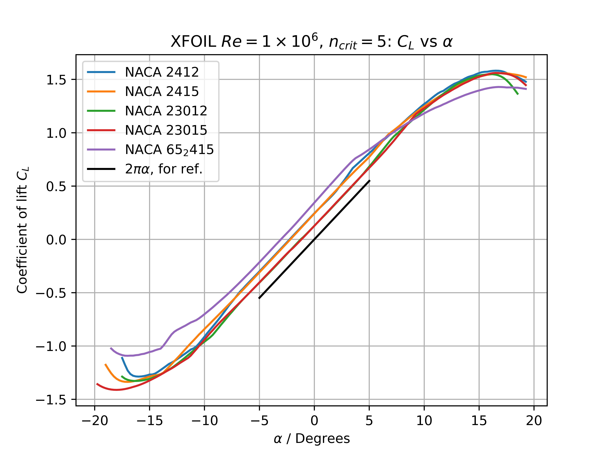
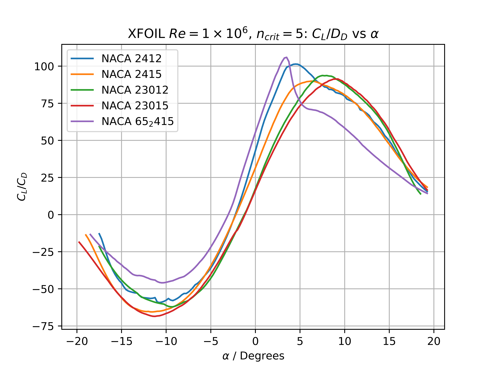

# AERO3630 - Assignment 2 2023

**Samuel Shelton z5359712**

## Question 1: Reflection

**Reflect upon your design based on your learning and feedback obtained since your part 1 submission.**

For Assignment 1 I opted for a tapered planform (taper ratio $\lambda = 0.4$) with a wing area of , which would require a coefficient of lift . Overall I am still very happy with my selection, and I feel that the content delivered in lectures since I submitted Assignment 1 have further validated my design choices. For context, the following are exerts from assignment 1 that summarise my design choices and recount the provided cruise characteristics.

> **Table 1:** Cruise Parameters Assigned for Assignment 1

| **Parameter**                                               | **Value**
| ----------------------------------------------------------- | --------------------------------- |
| **MTOW (kg)\***                                             | 2,558 kg                          |
| **Cruising Mach Number\***                                  | 0.22                              |
| **Cruising Altitude\***                                     | 2,135 m / c. 7,000 ft             |
| **Cruising Velocity†**                                      | 73 m s-1 / c. 263 km/h |

\*Provided, † Derived from Provided and Standard Atmosphere 

> **Table 2:** Design Choices and Reasoning for Assignment 1

| **Design Element**                                           | **Selection**       | **Reasoning**                                                                                                                                              |
| ------------------------------------------------------------- | ------------------------------ | ---------------------------------------------------------------------------------------------------------------------------------------------------------- |
| **Planform**                                                     | Tapered                         | Compromise of performance (elliptical planform) and manufacturability (rectangular planform)                                                               |
| **Wing Area**                                                   | 32 m2       | Minimum (as to reduce drag) with reasonable $C_L$                         |
| **Wing Loading**                                             | 78.94 kg m-2 | Reasonable value; consequence of choosing Wing Area to get a good $C_L$ |
| **Coefficient of Lift** **$C_L$**                                       | 0.30                     | Maximum reasonable value                                                                                                                                   |
| **Aspect Ratio**                                              | 10                       | Large value to match market trends of more efficient aircraft; disadvantages in climb speed performance less applicable with low ceiling                   |
| **Taper Ratio** **$\lambda$**                         | 0.4                      | Standard recommended value for subsonic wings                                                                                                              |
| **Wing Span**                                                 | 17.89 m                  | Consequence of Wing Area and Aspect Ratio                                                                                                                  |
| **Inner Chord**                                               | 2.56 m                   | Consequence of Wing Area, Aspect Ratio and $\gamma$                        |
| **Outer Chord**                                              | 1.02 m                   | Consequence of Wing Area, Aspect Ratio and $\gamma$                        |
| **Wing Tip**                                                    |  Winglet                  | Winglets reduce drag by reducing induced drag at wing tips, could also use other appropriate tips                                                          |

> **Figure 1:** Planform Diagram

To reiterate: I am extremely happy with my design selection and the knowledge I have gained on wing design since submitting Assignment 1 has only reinforced this.

## Question 2: Airfoil Selection

**Using a thin-airfoil assumption, select a NACA airfoil section profile for your wing. Explain and justify your selection.**

In order to use a thin-airfoil assumption, our selected airfoil (which must be a NACA airfoil) should be thin (maximum thickness $14 \%$ the chord length) or at least behave like a thin airfoil (i.e., the lift vs angle of attack slope $a \approx 2 \pi$). It would also be useful to note that our cruise characteristics have $\text{Re} \approx 8 \times 10^6$ (calculated using the Aerodynamic Mean Chord).

In order to speed up the comparison of airfoils, we can use panel methods through XFOIL to quickly calculate values for multiple airfoils. In order to do this, we should first verify that the thin airfoil model approximates panel methods by calculating an airfoil ourselves. We will select the NACA 23015, although the maths is pretty general. The nomenclature can be 'decoded' as follows:

> **Table 3:** NACA 23015 Nomenclature Decoded

| Digit | Value | Meaning |
|--|--|--|
|1| 2 | Design $C_L = 0.30$ |
|2| 3 | Maximum Cambre at $15 \%$ Chord |
|3| 0 | Normal (not reflex) Camber Line |
|4/5| 15 | Maximum Thickness is $15 \%$ Chord |

The NACA 5 Digit Series airfoils (without a reflexed camber line) have their camber line described by the following equation (where the height is specific to chord length):

$$
z_c =
\begin{cases}
    \frac{k}{6} \left( x^3 - 3 r x^2 + r^2 \left( 3 - r \right) x \right), & 0 \leq x < r \\
    \frac{k r^3}{6} \left( 1 - x \right), & r \leq x \leq 1
\end{cases}
$$

$k$ and $r$ are constants that are specific for individual airfoils. In the case of the 23015, $k = 15.957$ and $r = 0.2024$. This does mean that our maths here can be generalised to any NACA 5 digit series (and similar derivations exist for NACA 4 digit airfoils and 6 digit airfoils).

Before plug-in these values into Thin Airfoil Theory, we should note that an airfoil with a thickness of $15 \%$ chord is pushing the assumptions of a 'thin' airfoil. The most important test, however, is that $a \approx 2 \pi$, which will be validated as a reasonable assumption by both panel methods (XFOIL) and experimental data (for the 23015, not airfoils of $15 \%$ thickness in general).

Recall the fundamental equations of Thin Airfoil Theory:

$$
c_\ell = 2 \pi \left[\alpha + \frac{1}{\pi} \int_{0}^{\pi} {\frac{dz}{dx} \left( \cos {\theta}_0 - 1 \right) d {\theta}_0 } \right], \qquad x = \frac{C}{2} \left( 1 - \cos \theta_0 \right)
$$

Because our expression for $z$ is already $z_C$, we can set $C=1$. The fist step is trivially differentiating $z_C$:

$$
\frac{d z}{dx} = 
\begin{cases}
    \frac{k}{6} \left( 3 x^2 - 6 r x + r^2 \left( 3 - r \right) \right), & 0 \leq x < r \\
     - \frac{k r^3}{6} , & r \leq x \leq 1
\end{cases}
$$

We note that $\theta_0 = \cos^{-1} \left( 1 - 2 x \right)$, and we adjust out integrand bounds and substitute $\theta_0$ into our expression for $\frac{d z}{dx}$:

$$
\begin{array}{lr}
   x = 0 \implies \theta_0 = \cos^{-1} \left( 1 \right) = 0 \\
   x = r \implies \theta_0 = \cos^{-1} \left( 1 - 2 r \right) \equiv r' \\
   x = 1 \implies \theta_0 = \cos^{-1} \left( -1 \right) = \pi
\end{array}
$$

$$
\therefore \frac{d z}{dx} = \begin{cases}
    \frac{k}{6} \left( 3 \left( \frac{1}{2} \left( 1 - \cos \theta_0 \right) \right)^2 - 6 r \left( \frac{1}{2} \left( 1 - \cos \theta_0 \right) \right) + r^2 \left( 3 - r \right) \right), & 0 \leq \theta_0 < r' \\
    - \frac{k r^3}{6} , & r' \leq \theta_0 \leq \pi
\end{cases}
$$

$$
= \begin{cases}
    \frac{k}{8} \left( 1 - \cos \theta_0 \right)^2 - \frac{k r}{2} \left( 1 - \cos \theta_0 \right) + \frac{k r^2}{6} \left( 3 - r \right), & 0 \leq \theta_0 < r' \\
    - \frac{k r^3}{6} , & r' \leq \theta_0 \leq \pi
\end{cases}
$$

Now we can plug this into our fundamental thin airfoil equation:

$$
c_\ell = 2 \pi \left[ \alpha + \frac{1}{\pi} \int_{0}^{\pi} {\frac{dz}{dx} \left( \cos {\theta}_0 - 1 \right) d {\theta}_0 } \right] 
$$

$$
= 2 \pi \left[ \alpha +\frac{1}{\pi} \int_{0}^{r'} \left[ \frac{k}{8} \left( 1 - \cos \theta_0 \right)^2 - \frac{k r}{2} \left( 1 - \cos \theta_0 \right) + \frac{k r^2}{6} \left( 3 - r \right) \right] \left( \cos {\theta}_0 - 1 \right) d {\theta}_0 + \frac{1}{\pi} \int_{r'}^{\pi} \left[ - \frac{k r^3}{6} \right] \left( \cos {\theta}_0 - 1 \right) d {\theta}_0 \right]
$$

$$
= 2 \pi \alpha+ \int_{0}^{r'} \frac{k}{4} \left( \cos {\theta}_0 - 1 \right)^3 + k r \left( \cos {\theta}_0 - 1 \right)^2+ \frac{k r^2}{6} \left( 3 - r \right) \left( \cos {\theta}_0- 1 \right) d \theta_0- \int_{r'}^{\pi} \frac{k r^3}{3} \left( \cos {\theta}_0 - 1 \right) d {\theta}_0
$$

This can't be easily simplified further (it can be done, but it gets large quickly). We will use computational methods in a CAS (Computer Algebraic System) package to evaluate this integral for the NACA 23015. I decided to use MATHEMATICA, but I did verify the result in Maple. MATHEMATICA yields:

$$
c_\ell \left( \alpha \right) = 2 \pi \alpha + 0.159527
$$

The code for this is included in the Appendix. We can quite trivially rearrange this and solve for $\alpha$ with $c_\ell = 0$ to obtain $\alpha_{L=0} = -0.0253895 = - 1.45^{\circ}$.

We can plot the thin airfoil algebra result against a computational, panel methods approach from XFOIL:

![Comparison of Thin Airfoil Theory and Panel Methods from XFOIL[1]](Thin_v_XFOIL_23015.png)

> **Figure 2:** Comparison of Thin Airfoil Theory and Panel Methods from XFOIL[1]

This result should give us good confidence in using XFOIL in place of more tedious algebra for other airfoils. Using collated XFOIL data[1], and informed by a chart of the target design parameters of several popular airfoils by Shovel[2], we can produce the following plots:

> **Figure 3:** Comparison of Airfoils $c_L$ v $\alpha$

> **Figure 4:** Comparison of Airfoils c_D v $\alpha$

> **Figure 5:** Comparison of Airfoils $\frac{c_L}{c_D}$ v $\alpha$

Of course, one should note that the extremis of the XFOIL data (i.e., $|\alpha| > 10^{\circ}$) is *much* less reliable than the data close to $\alpha = 0$. Data is especially unreliable where the XFOIL data is not smooth. We can collate some of this XFOIL data into the following table:

> **Table 4:** Airfoil Comparison, data from XFOIL

| **Airfoil** | $C_L @ C_{D \text{ min}}$ | $\alpha_{L=0}$ | $\frac{C_L }{C_D}\text{max}$ | $a_0/2\pi$ | Examples [3]|
|---|---|---|---|---|---|
|**NACA 2412**|$0.34$|$-2.25^{\circ}$| $101.38$ | $\approx 1$ | Cessna 172 & others, Grumman Mohawk |
|**NACA 2415**|$0.40$|$-2.20^{\circ}$| $89.89$ | $\approx 1$ |  Some Cessna and a lot of Failed Northrop naval prototypes|
|**NACA 23012**|$0.23$|$-1.25^{\circ}$| $93.68$ | $\approx 1$ | Beech King Air & Baron, Bell 30 (Bell's first Helicopter) |
|**NACA 23015**|$0.045$|$-1.20^{\circ}$| $91.35$ | $\approx 1$ | BAC Strikemaster, CAC Avon Sabre, Piper PA-46|
|**NACA 652-418**|$0.20$|$-3.05^{\circ}$| $101.9$ | $\approx 1$ |BAC Jetstream, DeHavilland Dash 7 |

All these airfoils appear to behave close to thin airfoils (that is, $a \approx 2 \pi$). It is quite obvious that these datapoints don't tell the entire story, and the characteristics from the diagrams also need to be considered.

The NACA 652-418 has a relatively extreme $\alpha_{L=0}$ and has much more complex $\frac{L}{D}$ behaviour than the 4 and 5 digit series'. The 2412 has similar issues to the 652-418, as evidenced by the $\frac{C_L}{C_D}$ graph, and the 2415 doesn't perform as well in terms of $\frac{L}{D}$ when compared to the 23015 and 23012.

We will choose the 23015 over the 23012 because of the sharp drop-off on the $C_L$ v $\alpha$ graph for the 23012 (as predicted by XFOIL). This translates to significantly worse stall characteristics compared to the 23015, meaning the aircraft would be expected to stall quicker and more violently. 

## Question 3: Cruise Angle of Attack Selection

**Using thin airfoil theory, select the cruise angle of attack. Explain why this has been chosen. How does it compare with experimental data?**

With an infinite wing (which you could alternatively view as a wing with $\text{AR}=\infty$).. For the 23015 we can use the thin airfoil equation we derived using Calculus to solve for $\alpha$ when $c_\ell = 0.3$:

$$
C_L = 0.30 = 2 \pi \alpha + 0.159527
$$

$$
\therefore \alpha = 0.022357 = 1.28^{\circ}
$$

We already assumed $\text{Thin Airfoil} \implies a = 2 \pi$ when we used thin airfoil theory in the first place. In terms of drag, we can use some XFOIL data for the appropriete angle of attack to give us *some* insight, but thin airfoil theory is not capable of producing a value here by itself.

$$
\text{Infinite Span} \implies \text{AR} = \infty, \qquad \therefore C_{D,i} = \frac{C_L^2}{\pi \text{AR}} \left(1 + \delta \right) = 0, \qquad \therefore \alpha_\text{eff} = \frac{C_L}{\pi \text{AR}} = 0
$$

$$
C_D = c_D + C_{D,i} = c_D, \qquad c_D = 0.008 \text{ from XFOIL}, \qquad \therefore C_D = 0.008
$$

We should compare this to some experimental data. This data, from Anderson's *Fundamentals of Flight*[4], has both section lift and drag coefficients for the 23015. The way this chart is arranged also means we don't need to calculate $\alpha_\text{eff}$ and can just calculate $c_D$ straight from $c_L$.

![Experimental Data for the NACA-23015[4]](Anderson_23015_Diagrams.png)

> **Figure 6:** Experimental Data for the NACA-23015 from Anderson's *Fundamentals of Aerodynamics*[4]

We can take the slope of this data as $a_0$, and take $\alpha_{L=0}$ from its intercept. We can redo similar calculations to the purely theoretical case as shown.

$$
\text{Infinite Wing} \implies a = a_0 = 5.96 \text{ Radians}, \quad \alpha_{L=0} = - 1.14^{\circ} \qquad \text{From Graph}
$$

$$
C_L = a_0 \left( \alpha - \alpha_{L=0} \right), \qquad = 0.30 = 5.96 \left( \alpha + 1.14^{\circ} \right), \qquad \therefore \alpha = 1.74^{\circ}
$$

We can quickly calculate drag, similarly to before:

$$
\text{Infinite Wing} \implies C_{D,i} = 0, \qquad \therefore C_D = c_D = 0.006 \text{ From Graph}
$$

It shouldn't really be a surprise that the experimental data predicts a lower $C_D$ than the theoretical data. The 23015 is - by its very name - best when operating with its design lift coefficient, $C_L = 0.30$. The XFOIL predicted $C_L$ at lowest $C_D$ is *not* 0.30, which shows that the XFOIL isn't accurately modeling the $C_D$ of the airfoil.

## Question 4: Considering Finite Span

**Update your aerodynamic analysis (calculate the new angle of attack and overall drag coefficient) by now considering the finite span of the wing.**

To account for a finite wing, we need a way of estimating $\delta$. We will use the method proposed by Hörner and evaluated as sound by Nita and Scholz[5]. We can use the following graph (which has been normalised from the original paper with our wing area, $32 \text{m}^2$) to find the appropriate correction factor, $\delta$:

![Hörner $\delta$ estimation[5]](delta_chart.png)

> **Figure 7:** Normalised Hörner approximation of $\delta$[5]

From this diagram we can get $\delta = 0.0623$. We can redo our aerodynamic analysis both for the thin airfoil and experimental case (and compare results!). Starting with the thin airfoil analysis. Assuming $\delta = \tau$:

$$
\text{Thin Airfoil} \implies a_0 = 2 \pi, \qquad a = \frac{a_0}{1 + \frac{a_0}{\pi \text{AR}}\times \left( 1 + \delta \right)} = \frac{2 \pi}{1 + \frac{2 \pi}{\text{10 }\pi}\times \left( 1 + 0.0623 \right)} = 5.18
$$

$$
C_L = 0.30 = 5.18 \left( \alpha  - 0.025 \right), \qquad \therefore \alpha = 0.033 = 1.86^{\circ}
$$

We can also recalculate drag, using an XFOIL $c_D$ from $\alpha_\text{eff}$ and a non-zero $C_{D,i}$:

$$
C_{D,i} = \frac{C_L^2}{\pi \text{AR}} \times \left( \delta + 1 \right) = \frac{0.30^2}{10 \pi} \times 1.0623 = 0.0029
$$

$$
\alpha_\text{eff} = \frac{C_L}{\pi \text{AR}}  = \frac{0.30}{10 \pi} = 0.00955 = 0.547^{\circ}, \qquad \therefore c_D = 0.008
$$

$$
C_D = c_D + C_{D,i} = 0.008 + 0.0029 = 0.011
$$

Notice how close $\alpha_\text{eff}$ is to the optimal $\alpha$ with the lowest $c_D$.

We can similarly recalculate $C_D$ and $C_L$ for our experimental model, using the data from Figure 6.

$$
 a = \frac{a_0}{1 + \frac{a_0}{\pi \text{AR}}\times \left( 1 + \delta \right)} = \frac{5.96}{1 + \frac{5.96}{\text{10 }\pi}\times \left( 1.0623 \right)} = 2.97
$$

$$
\therefore 0.30 = 2.97 \left( \alpha + 1.14^{\circ} \right), \qquad \alpha = 0.0812 = 4.65^\circ
$$

We can also calculate a new coefficient of drag, using $c_D$ at $c_L = 0.3$ from Figure 6.

$$
C_{D,i} = \frac{C_L^2}{\pi \text{AR}} \times \left(1 + \delta \right) = \frac{0.30^2}{10 \pi} \times 1.0623 = 0.015
$$

$$
C_D = C_{D, i} + c_D = 0.015 + 0.006, \qquad C_D = 0.021 
$$

## Question 5: High-Lift Device Requirements

**Assume an approach speed of $120 \ \text{km/h}$ (for landing) [$ 50 $ knot stall speed $\times \ 1.3$ margin]. Given your wing design, specify a high-lift device requirement (specify $\Delta C_L$).**

We will assume the landing weight is the same as the MTOW (i.e., no fuel weight loss in flight and no need for fuel dumping to land) and that we will be landing at sea level $\text{Alt} = 0$ (which is a fine assumption for Australia, but not Nepal or Colorado, for example):

$$
F_L = F_W, \qquad mg = \frac{1}{2} \rho A V^2 \left( C_L + \Delta C_L \right)
$$

$$
2558 \times 9.81 = 0.5 \times 1.225 \times 32 \times 33.\overline{3} ^2 \times \left( 0.3 + \Delta C_L \right)
$$

$$
\therefore \Delta C_L = 0.852
$$

It should be noted that this $\Delta C_L$ doesn't have to come *entirely* from high-lift devices, and adjusting the angle of attack and flaring the aircraft for landing can contribute a significant amount to this.

## References / Appendix

[1] Collated XFOIL Data from 

[2]  Shovel, R.S., *Fundamentals of Flight*, Prentice Hall, 2nd edn, 1989.

[3] Lednicer, D, *The Incomplete Guide to Airfoil Usage*, The University of Illinois Urbana-Champaign Department of Aerospace Engineering & Aeromechanical Solutions LLC, September 2010 accessed March 2023, available [here](https://m-selig.ae.illinois.edu/ads/aircraft.html).

[4] Anderson J.D., *Fundamentals of Aerodynamics*, McGraw Hill Education, 6th edn, 2017, p. 425.

[5] Sholz D. & Niţǎ, M.,  *Estimating the Oswald Factor from Basic Aircraft Geometrical Parameters*, 2012, available through open access [here](https://www.dglr.de/publikationen/2012/281424.pdf).

Raymer D.P., *Aircraft Design: A Conceptual Approach*, American Institute of Aeronautics and Astronautics, 6th edn, 2018.

XFOIL 6.99 from MIT (accessible [here](https://web.mit.edu/drela/Public/web/xfoil/)) was used running under a virtual machine.

The MATHEMATICA code to perform that integration is here:

    TAFT[\[Alpha], r_, k_] := 2 * \[Pi] * \[Alpha] + Integrate[
        
        k/4*(Cos[\[Theta]] - 1)^3 + k*r*(Cos[\[Theta]] - 1)^2 + (k*r^2)/6*(3 - r)*(Cos[\[Theta]] - 1)
        
    , {\[Theta], 0, ArcCos[1 - 2*r]}] - Integrate[
            
        (k*r^3)/3*(Cos[\[Theta]] - 1)
        
    , {\[Theta], ArcCos[1 - 2*r], \[Pi]}]
    

    TAFT[\[Alpha], 0.2025, 15.957]

Everything else (all python code for graphic, XFOIL data, diagrams exe) can be found [here](https://github.com/Sam-js2/AERO3660_ASS2) on GitHub.
